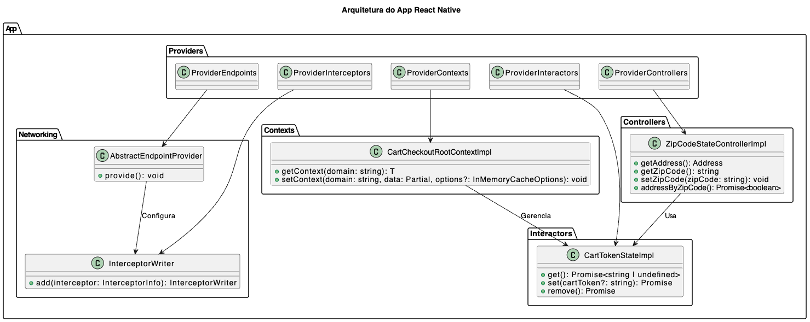

# Arquitetura do Aplicativo React Native

## Visão Geral
O aplicativo segue uma arquitetura baseada em providers, que organizam e estruturam a lógica de negócio e o fluxo de dados. Essa arquitetura é composta pelos seguintes componentes principais:

- **Endpoints**: Gerenciam as configurações das chamadas de API.
- **Interceptors**: Manipulam requisições e respostas de rede antes e depois de serem processadas.
- **Contexts**: Responsáveis pelo gerenciamento de estado global e compartilhado dentro do app.
- **Interactors**: Implementam regras de negócio e manipulação de dados.
- **Controllers**: Atuam como intermediários entre os repositórios e a lógica de negócio.

## Estrutura dos Componentes

### 1. Endpoints
Os **Endpoints** são definidos por meio de um provedor abstrato, como visto na classe `AbstractEndpointProvider`. Eles gerenciam a configuração das requisições, permitindo uma estrutura modular e adaptável para comunicação com serviços externos.

```ts
import { EndpointConfigMapper } from "@rd-core-networking/api";

export abstract class AbstractEndpointProvider {
  constructor(protected config: EndpointConfigMapper) {}
  
  abstract provide(): void;
}
```

### 2. Interceptors
Os **Interceptors** permitem modificar as requisições e respostas de rede antes que sejam processadas pelo app. Eles são úteis para adicionar headers de autenticação, monitoramento e tratamento de erros.

```ts
export interface InterceptorWriter {
  add(interceptor: InterceptorInfo): InterceptorWriter;
}

export interface InterceptorInfo {
  before?(options: InterceptorInfoBeforeOptions): Promise<InterceptorStatus>;
  after?(options: InterceptorInfoAfterOptions): Promise<InterceptorStatus>;
}
```

### 3. Contexts
Os **Contexts** são utilizados para gerenciar o estado global do aplicativo. O exemplo `CartCheckoutRootContextImpl` demonstra a criação de múltiplos contextos relacionados ao fluxo de checkout.

```ts
export class CartCheckoutRootContextImpl implements CartCheckoutRootContext {
  private cartCheckoutRootContextDomains: CartCheckoutContextDomains = {
    buyAndPickupContext: createBuyAndPickupContext,
    cartContext: createCartContext,
    checkoutPhasedContext: createCheckoutPhasedContext,
    deliveryContext: createDeliveryContext,
    paymentContext: createPaymentContext,
    subscriptionContext: createSubscriptionContext,
    summaryContext: createSummaryContext,
    trackingPhoneContext: createTrackingPhoneContext,
    bestBenefitContext: createBestBenefitContext,
    locationsCartContext: createLocationsCartContext,
    omniChannelContext: createOmniChannelContext,
  };

  constructor(private readonly inMemoryCache: InMemoryCache) {
    this.initContexts();
  }

  private initContexts(): void {
    Object.keys(this.cartCheckoutRootContextDomains).forEach((domain) => {
      this.inMemoryCache.set(domain, this.cartCheckoutRootContextDomains[domain as keyof CartCheckoutContextDomains]);
    });
  }
}
```

### 4. Interactors
Os **Interactors** representam a lógica de negócio, permitindo a manipulação dos dados armazenados. Um exemplo de interactor é `CartTokenStateImpl`, que gerencia o estado de um token do carrinho.

```ts
export class CartTokenStateImpl implements CartTokenState {
  private internallyCartToken?: string;

  public async get(): Promise<string | undefined> {
    return this.internallyCartToken;
  }

  public async set(cartToken?: string): Promise<void> {
    if (cartToken) {
      this.internallyCartToken = cartToken;
    }
  }

  public async remove(): Promise<void> {
    this.internallyCartToken = undefined;
  }
}
```

### 5. Controllers
Os **Controllers** atuam como intermediários entre os repositórios e a lógica de negócio, fornecendo métodos bem definidos para interagir com os dados. Um exemplo é `ZipCodeStateControllerImpl`, que gerencia o estado do CEP e do endereço associado.

```ts
export class ZipCodeStateControllerImpl implements ZipCodeStateController {
  constructor(private zipCodeStateRepository: ZipCodeStateRepository) {}

  getAddress(): Address | undefined {
    return this.zipCodeStateRepository.getAddress();
  }

  getZipCode(): string {
    return this.zipCodeStateRepository.getZipCode();
  }

  setZipCode(zipCode: string): void {
    this.zipCodeStateRepository.setZipCode(zipCode);
  }

  async addressByZipCode(): Promise<boolean> {
    return await this.zipCodeStateRepository.addressByZipCode();
  }
}
```

## Diagrama de exemplo da arquitetura do app

